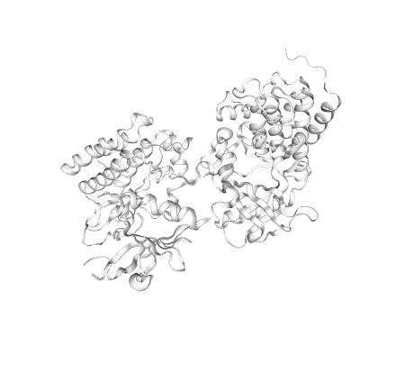

# aspen-protein-viewer

This is the Lit Element wrapper web-component built on top of [ngl viewer](https://github.com/nglviewer/ngl) to render the 3D structure of the protein from [RCSB PDB (Protein Data Bank)](https://www.rcsb.org/).

# Installation and usage

Install this component using either of the following command

```
npm i github:aspen-elements/aspen-protein-viewer

yarn add github:aspen-elements/aspen-protein-viewer
```

## Basic Usage

```js
import { LitElement, html, css } from "lit-element";
import "aspen-protein-viewer/ngl-viewer";

class BasicExample extends LitElement {

  static get styles() {
    return css`
      .ngl-viewer-wrapper {
        width: 400px;
        height: 400px;
      }
    `;
  }

  render() {
    return html`
      <div class="ngl-viewer-wrapper">
        <ngl-viewer pdbID="rcsb://4F0I"> </ngl-viewer>
      </div>
    `;
  }
}

customElements.define("basic-example", BasicExample);
```



## Advance Usage

```js
import { nothing } from "lit-html";
import "aspen-protein-viewer/ngl-viewer";
import { LitElement, html, css } from "lit-element";

class AdvanceExample extends LitElement {
  static get styles() {
    return css`
      .ngl-viewer-wrapper {
        width: 400px;
        height: 400px;
      }
    `;
  }

  static get properties() {
    return {
      isLoaded: { type: Boolean },
      isError: { type: Boolean },
    };
  }

  constructor() {
    super();
    this.isLoaded = false;

    this.onLoadFail = this.onLoadFail.bind(this);
    this.onLoadSuccess = this.onLoadSuccess.bind(this);
  }

  onLoadSuccess() {
    this.isLoaded = true;
  }

  onLoadFail() {
    this.isError = true;
  }

  render() {
    const colorArray = [
      {
        id: "1",
        title: "REL 1",
        startRange: 40,
        endRange: 210,
        color: "#aa00ee",
      },
      {
        id: "2",
        title: "LER 2",
        startRange: 210,
        endRange: 314,
        color: "#0000ff",
        references: [],
      },
      {
        id: "3",
        title: "HET 3",
        startRange: 316,
        endRange: 600,
        color: "#00aa00",
        references: [],
      },
      {
        id: "4",
        title: "HRR 4",
        startRange: 0,
        endRange: 40,
        color: "#FE9DFE",
        references: [],
      },
    ];

    return html`
      <div class="ngl-viewer-wrapper">
        ${this.isLoaded
          ? html`<div>Load complete</div>`
          : html`<div>Not Loaded</div>`}

        <ngl-viewer
          pdbID="rcsb://1HE7"
          .colorRegistry="${colorArray}"
          .onLoadFail="${this.onLoadFail}"
          .onLoadSuccess="${this.onLoadSuccess}"
        ></ngl-viewer>

        ${this.isError ? html` <div>Error Encountered</div>` : nothing}
      </div>
    `;
  }
}

customElements.define("advance-example", AdvanceExample);
```


## Props

| Props         | Type     | Description                                                                                                                                                                                                         |
| ------------- | -------- | --------------------------------------------------------------------------------------------------------------------------|
| pdbID         | String   | (Required) Holds the pdbID, for example: `"rcsb://4f0i"`, For more details: [RCSB PDB (Protein Data Bank)](https://www.rcsb.org/) and [List of pdbID](http://www.rsc.org/suppdata/mb/c4/c4mb00675e/c4mb00675e1.pdf)                  |
| colorRegistry | Array    | (Optional) Array to add custom color to 3D protein structure. The array should have object with startRange, endRange and color of the 3D protein. eg. [{startRange:0, endRange:500, color: "#FE9DFE"}]                           |
| onLoadFail    | Function | (Optional) CallBack function that is called after Error is encountered                                                                                                                      |
| onLoadSuccess | Function | (Optional) Callback function that is called after 3D protein has been loaded successfully                                                                                                                     |
